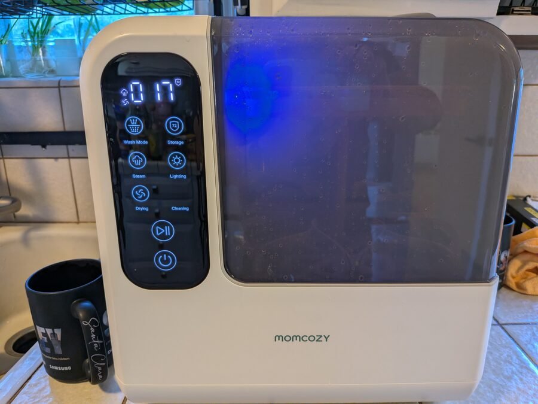
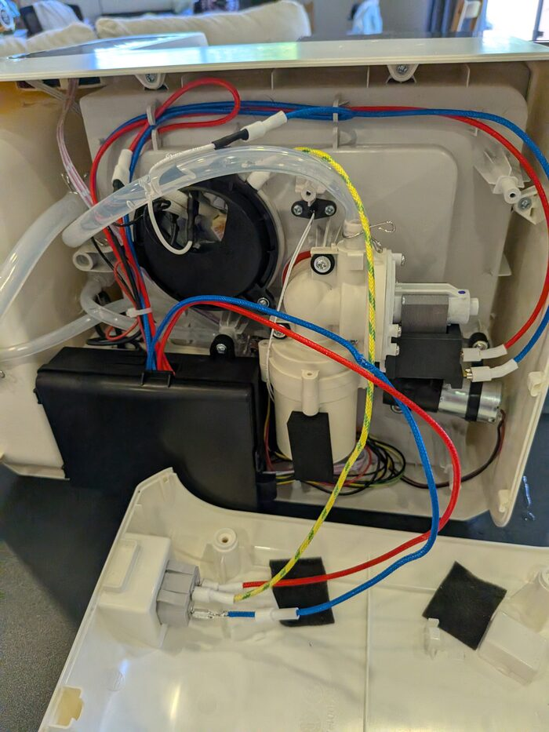
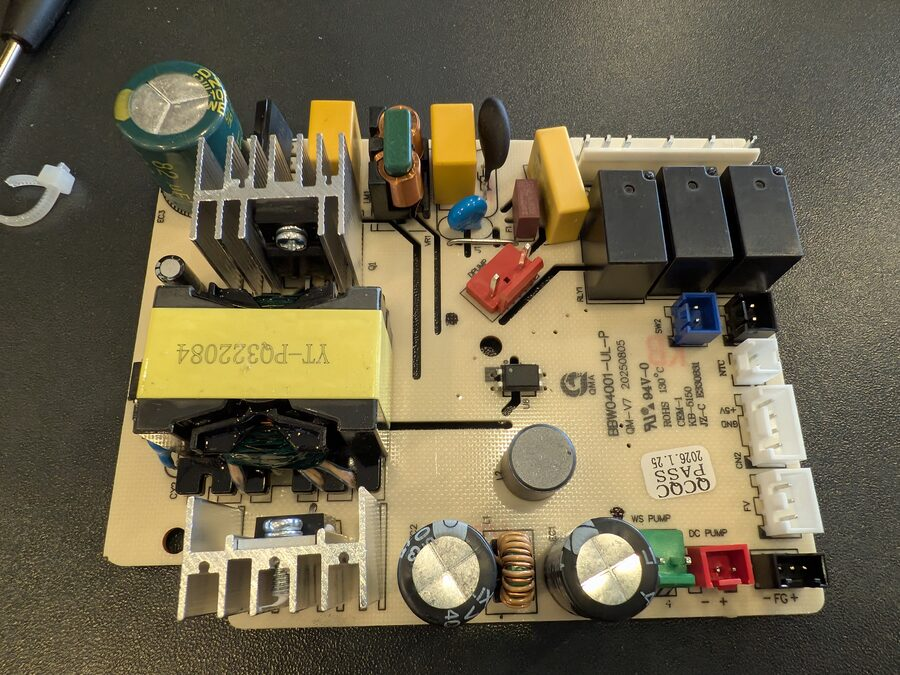

<h1 align="center">Smart Baby Washer</h1>

<p align="center">
  <b>App and Home Assistant control for a baby-bottle washer, from an ESP32-C3
  that plugs inline on the panel cable.</b>
</p>

<p align="center">
  
  
  
  
  
</p>

<p align="center">
  
</p>

- Sits on the 4-pin serial link between the front panel and the controller board,
  forwarding every frame and rewriting any byte in flight.
- **Reversible** — `CN2` is a plug-in connector, so the module goes inline on the
  existing cable. Nothing cut, nothing soldered to the OEM board.
- ⚠️ **Verified on two Momcozy D8 units** — an early button-panel one (board
  `BBW04001-UL-P`) and a later touch-panel one. Same firmware, unmodified, on
  both. See [what differs](#what-differs-between-the-two-units)

<p align="center">
  
</p>

## What it does

- **Web app + HTTP API** — pick a program, start/stop/resume, watch state,
  temperature and stage.
- **Home Assistant** — sensors, buttons, dashboard, notifications. Plain REST; no
  MQTT, no custom component.
- **Cycle runner** — six stock programs plus six of your own; durations and
  temperature targets persist; fills end on flow count, not a timer.
- **Interlocks the machine lacks** — no heater without a verified fill; pause on
  lid-open or no water; abort on over temperature, fill stall, fault bit or dead link.
- **Diagnostics** — drive each load on its own, inject `E0` `E3` `E4` `E5` `E7`
  (`E1`/`E6` have no bit), or run a whole cycle with nothing energised.
- **Live link decode** both directions, raw and rewritten, with temperature and
  flow graphs.
- Local only, no cloud. Logging is host-side; the ESP32 stores nothing.

<p align="center">
  
</p>

<p align="center">
  
</p>

> ⚠️ It can drive 120 V heaters and a water pump directly, and the machine's own
> controller will not stop you. Read [`docs/safety.md`](docs/safety.md) first.

<p align="center">
  
</p>

## What you build

- XIAO ESP32-C3 + a 4-channel BSS138 level shifter. Perfboard is enough; the
  carrier board in [`hardware/pcb/`](hardware/pcb/) is tidier, not better.
- Ground and +5 V pass straight through, so the panel never loses supply.
- ⚠️ Wire to the shifter's **printed pad names** — with HV facing the machine the
  pads read 4·3·2·1 down the board. The photo inset in the diagram shows it.
- 💡 Fit the external antenna. Inside a metal and wet plastic appliance the
  on-board one struggles, and losing WiFi means losing OTA.

<p align="center">
  
  &nbsp;
  
</p>

<p align="center">
  
</p>

<p align="center">
  
</p>

## Quick start

```bash
cp firmware/include/secrets.h.example firmware/include/secrets.h   # WiFi + OTA password
cd firmware
pio run -e c3 -t upload
```

- Open `http://baby-washer.local/`.
- **Start in LISTEN mode** — it cannot drive a line, so nothing can hurt the
  machine while you confirm the wiring.

## Docs

1. ⚠️ [**safety.md**](docs/safety.md) — what the machine does *not* protect you from
2. [**build.md**](docs/build.md) — parts, tapping the link, level shifting, wiring
3. [**flash.md**](docs/flash.md) — firmware, OTA, not bricking it out of reach
4. [**use.md**](docs/use.md) — the app, the engineering page, Home Assistant

Reference: [board.md](docs/board.md) · [protocol.md](docs/protocol.md) ·
[cycles.md](docs/cycles.md) · [api.md](docs/api.md) ·
[troubleshooting.md](docs/troubleshooting.md) · [hardware/pcb/](hardware/pcb/)

## Does it fit my machine?

Verified on **two** Momcozy D8 units — an early one (board `BBW04001-UL-P`,
button panel) and a later one (touch panel). Same 9600 8N1 link, same frame
layout, same load bitmap, and the same firmware ran both unmodified.

| | |
|---|---|
| Momcozy D8, either revision | works; the differences below are cosmetic to the protocol |
| Another Momcozy, different board | the link will likely decode, but treat every load bit as unknown until you watch it act |
| Any washer with a separate panel | the approach applies; everything past that is your own work |

- Minimum requirement: a separate front panel talking to a controller over a 4-pin
  connector carrying ground, +5 V and two signal lines.
- [`docs/protocol.md`](docs/protocol.md) has the frame format;
  `POST /api/detect` finds the pin map without ever driving a line.
- A capture from a non-D8 machine is useful — open an issue with `/api/frames`
  output and the board part number.

### What differs between the two units

Measured across 4165 frames from the early unit and 1699 from the later one.

| | early (button panel) | later (touch panel) |
|---|---|---|
| controller byte 6 | `0x02` | **`0x03`** — the only byte that differs by revision |
| controller byte 4 | `0x04` | `0x04` |
| status bit 6 | seen only when starved of panel frames | also asserted **spontaneously**, held for hours, with a byte-perfect link |
| lid bits (1 and 7) | reported normally (`0x02`, `0x80`, `0x82`) | **never seen set** in any capture |
| wash pump on `b0` | low-side switch **does not close** — needs the external relay | **works** — no relay needed |
| fill targets | `0x07 / 0x1C / 0x20 / 0x23 / 0xFF` | same five values |
| heater duty | alternates `wash+heat` ↔ `wash-pump-only` | same |

Two of those matter in practice:

⚠️ **`b0` works on the later unit.** The external wash-pump relay in
[build.md](docs/build.md) is a workaround for the early board's dead low-side
switch. Check yours before wiring a relay it does not need — command `b0` during
a wash and listen.

⚠️ **Status bit 6 is the controller's panel-frame-starvation latch.** On the
later unit it latches until mains removal; the panel renders it as `E5`. Any
gap in forwarding — a slow boot, a wedged relay, an interrupted OTA — can
trip it, which is why the firmware bridges the pads in the first milliseconds
of `setup()` and why you should never flash mid-cycle. The full investigation,
including the wrong turns, is in [`docs/postmortem.md`](docs/postmortem.md).

**Do not assume the error-code table transfers.** Ours comes from the early
unit's manual (`BW05`, p.29). A later panel may number its codes differently,
and reading `E5` as "communication failure" on a machine whose link is provably
clean will send you a long way in the wrong direction.

## Licence

MIT — see [`LICENSE`](LICENSE). No affiliation with Momcozy. Names and part
numbers appear for identification only.
