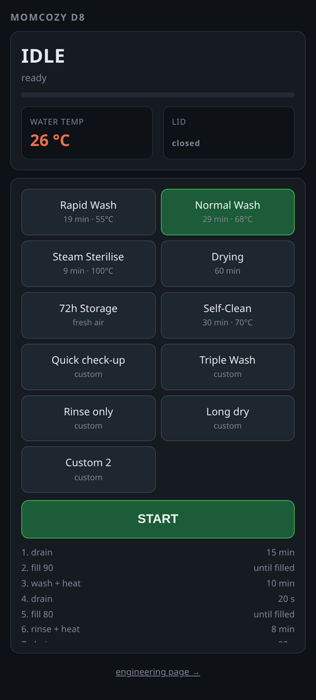
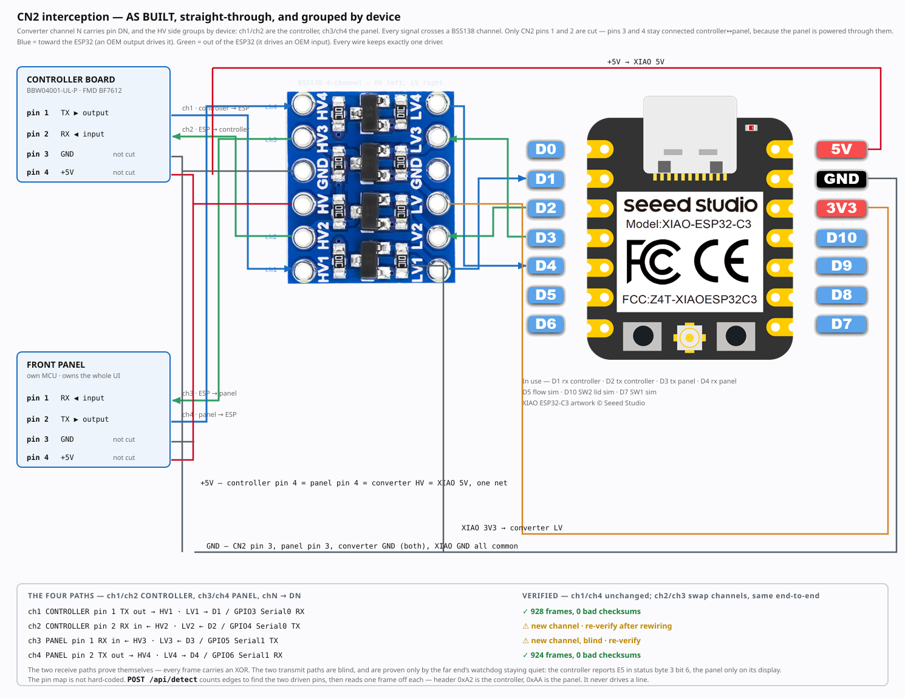
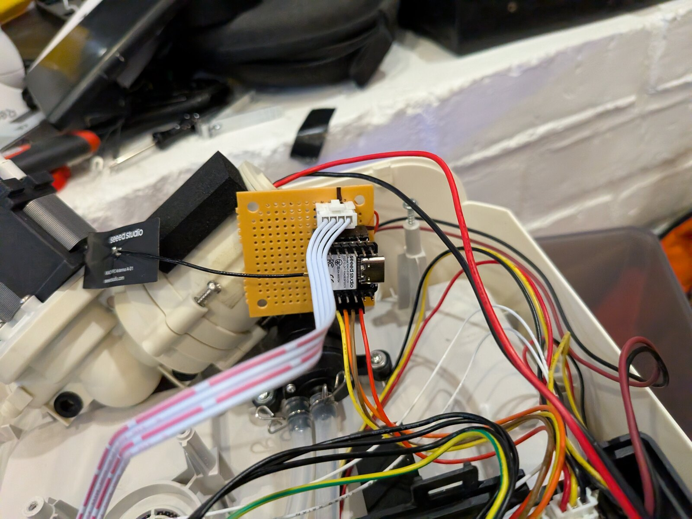

<h1 align="center">Smart Baby Washer</h1>

<p align="center">
  <b>App and Home Assistant control for a baby-bottle washer, from an ESP32-C3
  that plugs inline on the panel cable.</b>
</p>

<p align="center">
  
  
  
  
  
</p>

- Sits on the 4-pin serial link between the front panel and the controller board,
  forwarding every frame and rewriting any byte in flight.
- **Reversible** — `CN2` is a plug-in connector, so the module goes inline on the
  existing cable. Nothing cut, nothing soldered to the OEM board.
- ⚠️ **Developed and verified on one machine**: Momcozy D8 (`BW05`, board
  `BBW04001-UL-P`). See [does it fit my machine?](#does-it-fit-my-machine)

<p align="center">
  
</p>

## What it does

- **Web app** on the ESP32 — select a program, start/stop/resume, watch state,
  water temperature and stage.
- **HTTP API** for all of it, plus the decoded link state.
- **Home Assistant** — sensors, buttons, dashboard, notifications on finish,
  pause and fault. Plain REST; no MQTT, no custom component.
- **Cycle runner** — six programs from the manual plus six user slots. Stage
  durations and temperature targets persist. Fills end on flow count, not a timer.
- **Custom programs** — fixed-width stage syntax, edited in the browser or as JSON
  via `tools/cycle_tool.py`, validated before they are accepted.
- **Interlocks the machine lacks** — no heater without a verified fill; lid-open
  and no-water pause instead of abort; abort on over temperature, fill stall,
  fault bit or dead link.
- **Live link decode**, both directions, raw and rewritten, with 30 min of
  temperature and 60 s of flow history.
- **Error codes** with the manual's text, and injection of each confirmed one.
- **Cycle logging** host-side via `tools/cycle_log.py`. Nothing is stored on the
  ESP32; it holds ~63 s of traffic in RAM.
- Runs entirely on your own network — no cloud, no account.

<p align="center">
  
</p>

<p align="center">
  
</p>

> ⚠️ It can drive 120 V heaters and a water pump directly, and the machine's own
> controller will not stop you. Read [`docs/safety.md`](docs/safety.md) first.

<p align="center">
  
</p>

## What you build

- XIAO ESP32-C3 + a 4-channel BSS138 level shifter. Perfboard is enough; the
  carrier board in [`hardware/pcb/`](hardware/pcb/) is tidier, not better.
- Ground and +5 V pass straight through, so the panel never loses supply.
- ⚠️ Wire to the shifter's **printed pad names** — with HV facing the machine the
  pads read 4·3·2·1 down the board. The photo inset in the diagram shows it.
- 💡 Fit the external antenna. Inside a metal and wet plastic appliance the
  on-board one struggles, and losing WiFi means losing OTA.

<p align="center">
  
</p>

<p align="center">
  
</p>

## Quick start

```bash
cp firmware/include/secrets.h.example firmware/include/secrets.h   # WiFi + OTA password
cd firmware
pio run -e c3 -t upload
```

- Open `http://baby-washer.local/`.
- **Start in LISTEN mode** — it cannot drive a line, so nothing can hurt the
  machine while you confirm the wiring.

## Docs

1. ⚠️ [**safety.md**](docs/safety.md) — what the machine does *not* protect you from
2. [**build.md**](docs/build.md) — parts, tapping the link, level shifting, wiring
3. [**flash.md**](docs/flash.md) — firmware, OTA, not bricking it out of reach
4. [**use.md**](docs/use.md) — the app, the engineering page, Home Assistant

Reference: [board.md](docs/board.md) · [protocol.md](docs/protocol.md) ·
[cycles.md](docs/cycles.md) · [api.md](docs/api.md) ·
[troubleshooting.md](docs/troubleshooting.md) · [hardware/pcb/](hardware/pcb/)

## Does it fit my machine?

Only a Momcozy D8 is known to work — one machine, one board.

| | |
|---|---|
| Same board `BBW04001-UL-P` | should work as-is; check the silkscreen first |
| Another Momcozy, different board | the link will likely decode, but treat every load bit as unknown until you watch it act |
| Any washer with a separate panel | the approach applies; everything past that is your own work |

- Minimum requirement: a separate front panel talking to a controller over a 4-pin
  connector carrying ground, +5 V and two signal lines.
- [`docs/protocol.md`](docs/protocol.md) has the frame format;
  `POST /api/detect` finds the pin map without ever driving a line.
- A capture from a non-D8 machine is useful — open an issue with `/api/frames`
  output and the board part number.

## Licence

MIT — see [`LICENSE`](LICENSE). No affiliation with Momcozy. Names and part
numbers appear for identification only.
