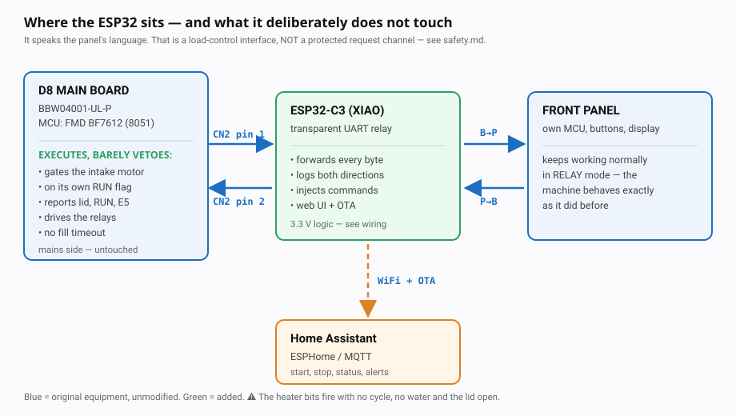
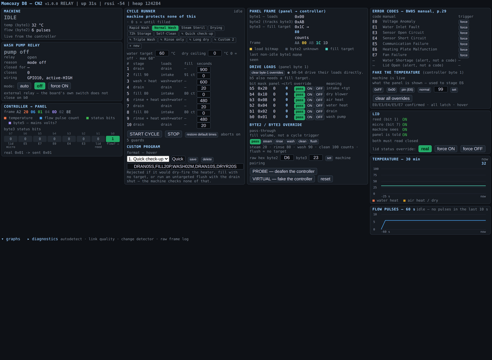
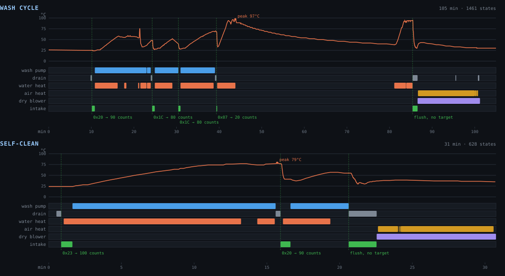

# Smart Baby Washer

Make a dumb baby-bottle washer app-controlled — without replacing its brain.

A **Seeed XIAO ESP32-C3** sits in the middle of the ribbon between the front panel
and the controller board, forwards every byte, and can rewrite any of them in
flight. The machine keeps working exactly as it did. You gain a web app, a Home
Assistant integration, and a cycle runner you can program.

Built and verified on a **Momcozy D8 DeepClean** (internal model `BW05`). The
approach transfers to any washer whose panel talks to its controller over a
serial link — see [`docs/protocol.md`](docs/protocol.md).

<p align="center">
  
</p>

> ⚠️ **This drives 120 V heaters and a water pump directly.** The machine's own
> controller will not stop you. Read [`docs/safety.md`](docs/safety.md) before you
> open anything.

## What you get

<p align="center">
  
</p>

- **A web app** on the ESP32 — pick a program, start it, watch temperature and
  progress. Mobile-sized. No cloud, no account.
- **Home Assistant** — entities, commands and a dashboard over plain HTTP. No
  MQTT broker, no custom component.
- **A programmable cycle runner** — six built-in programs plus six of your own,
  with per-stage durations you can edit. It carries interlocks the machine does
  not: no heater without a verified fill, and pause-not-abort on lid open or no
  water.
- **Full visibility** — live decode of both directions of the panel link,
  temperature and flow graphs, and the machine's real error codes with plain
  English next to them.

<p align="center">
  
</p>

## Getting there

1. ⚠️ [**safety.md**](docs/safety.md) — what the machine does *not* protect you
   from. Not optional reading.
2. [**build.md**](docs/build.md) — parts, where to tap, level shifting, wiring.
3. [**flash.md**](docs/flash.md) — build the firmware, get it on the board, keep
   OTA working once it is sealed inside the machine.
4. [**use.md**](docs/use.md) — the web app, the cycle runner, Home Assistant.

Reference: [**protocol.md**](docs/protocol.md) ·
[**api.md**](docs/api.md) ·
[**troubleshooting.md**](docs/troubleshooting.md) ·
[**hardware/pcb/**](hardware/pcb/) (optional carrier board)

## Quick start

```bash
cp firmware/include/secrets.h.example firmware/include/secrets.h   # WiFi + OTA password
cd firmware
pio run -e c3 -t upload
```

Open `http://d8-sniffer.local/`.

**Start in LISTEN mode** — it physically cannot drive a line, so nothing you do
can hurt the machine while you confirm the wiring.

## Does it fit my machine?

You need a washer where a **separate front panel** talks to a **controller board**
over a few wires. Look for a 4-pin connector carrying ground, +5 V and two signal
lines.

If yours is a different model, [`docs/protocol.md`](docs/protocol.md) describes
the frame format, and `POST /api/detect` finds the pin map for you without ever
driving a line. A capture from a machine that is not a D8 is very welcome — open
an issue.

## Licence

MIT — see [`LICENSE`](LICENSE). No affiliation with Momcozy. Names and part
numbers appear for identification only.
