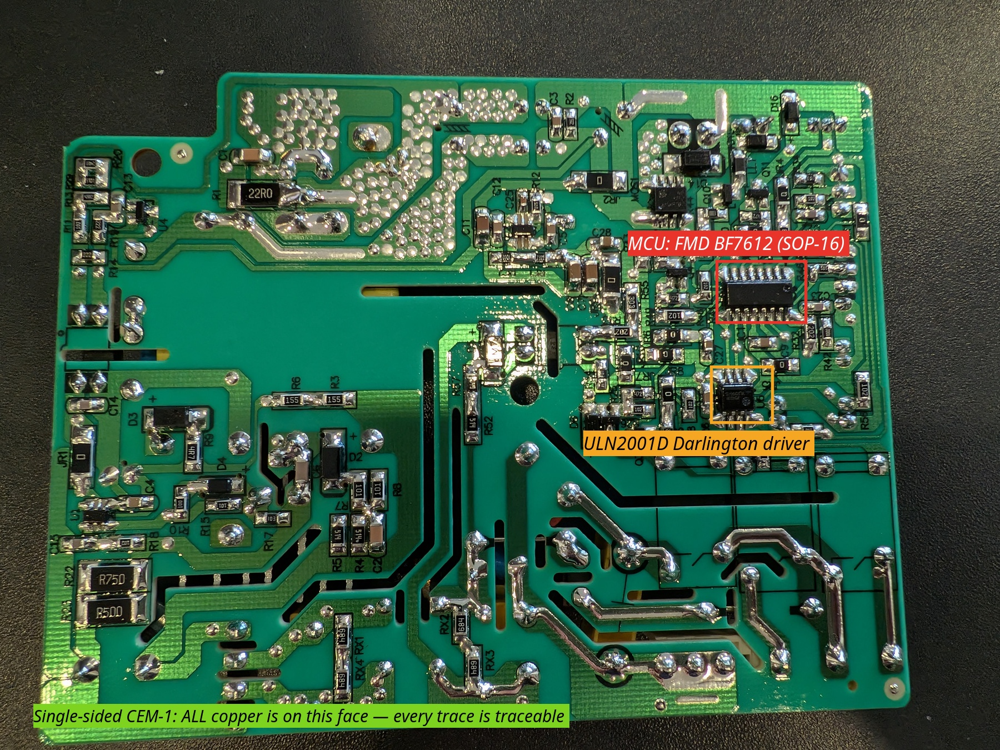
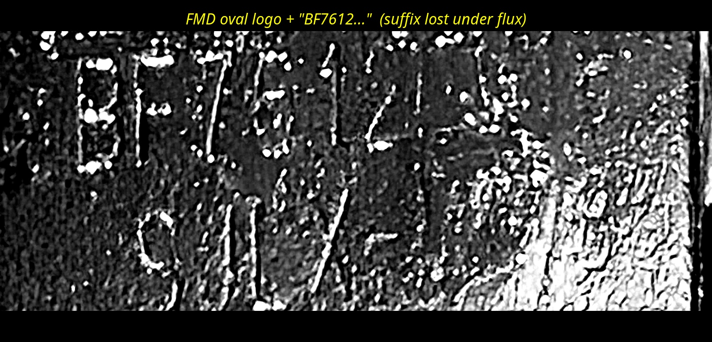
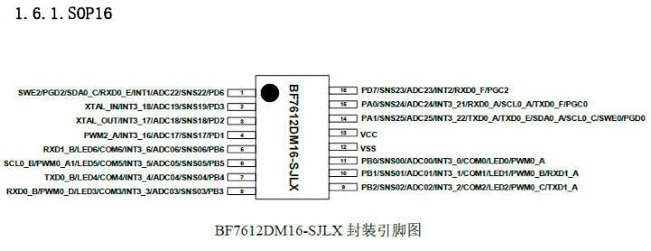
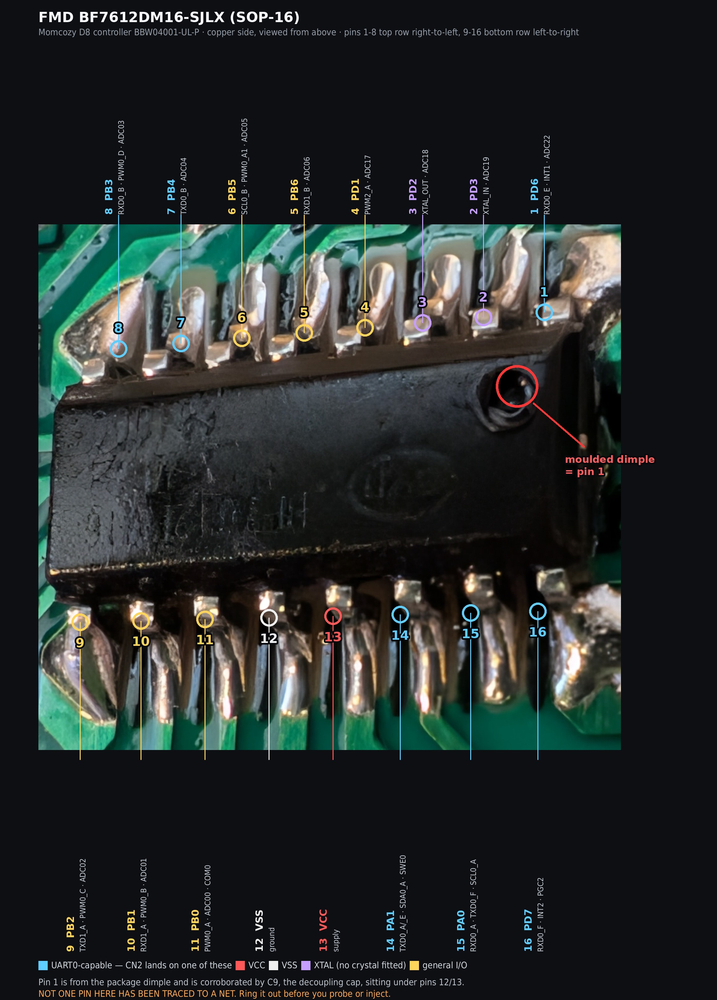
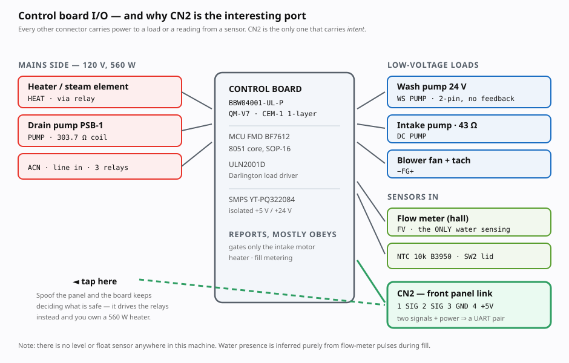

# Inside the machine

Reference for the Momcozy D8 (internal model **`BW05`**) — what is on the board,
which connector each load sits on, and where the panel link goes. Useful if you
are adapting this to a different washer, or tracing a fault.

⚠️ Everything here assumes the machine is **unplugged**. See [safety.md](safety.md).

⚠️ This is a teardown of **one unit**. Part numbers and connector positions may
differ even between D8 production runs — the board here is dated `20250805`.

## Machine

| Field | Value |
|---|---|
| Product | Momcozy D8 DeepClean — washer / steam steriliser / HEPA dryer |
| **Internal model code** | **`BW05`** — quote this for parts and support, not "D8" |
| Rated | 120 V ~ 60 Hz, **560 W** |
| Manufacturer | Hong Kong Lute Technology Co., Ltd |
| Cycles | Rapid 19 min @ 55 °C · Normal 29 min @ 68 °C · Self-Clean 30 min @ 70 °C |

Error codes are in [troubleshooting.md](troubleshooting.md#error-codes--bw05-manual-p29),
with what each one means and how to provoke it.

Non-numbered alerts (lights, not codes): *Water Shortage* and *Lid Open*.

## Control board

**`BBW04001-UL-P`** · `QM-V7` · dated `20250805` · UL 94V-0 · **CEM-1**

  

**Single-sided.** All copper is on the green face, with wire jumpers on the
component side. That matters more than it sounds: **every trace is visible**, so
the board is fully traceable from two photographs plus a continuity meter. If you
need to follow a signal, a DMM on continuity beats photo-tracing every time.

### Semiconductors

| Ref | Part | Package | Function |
|---|---|---|---|
| MCU | **FMD `BF7612DM16-SJLX`** | SOP-16 | main controller, 8051 core |
| — | **`ULN2001D`** (lot `254231`) | SOP-8 | Darlington array, load driver |
| — | `YT-PQ322084` | — | SMPS transformer, isolated +5 V / +24 V |

  

Reading the laser etch needs **raking light and an isopropyl wipe** to clear the
flux sparkle. The oval `FMD` logo (Fremont Micro Devices) and `BF7612` are
legible; the suffix is not.

Passives around the logic section read `101` `102` `103` `151` `201` `202` `203`
`470` `472` plus several `0 Ω` links.

### MCU pinout — `BF7612DM16-SJLX` (SOP-16)

  

Manufacturer pinout, supplied by the owner. **This is the datasheet, not the
board.** The laser marking on our chip reads `BF7612` with an unreadable suffix;
`DM16-SJLX` is the variant whose package matches what is fitted (SOP-16). No pin
here has been traced to a net on this board — treat the whole table as reference
until a continuity meter says otherwise.

| Pin | Functions |
|---:|---|
| 1 | `SWE2` `PGD2` `SDA0_C` `RXD0_E` `INT1` `ADC22` `SNS22` `PD6` |
| 2 | `XTAL_IN` `INT3_18` `ADC19` `SNS19` `PD3` |
| 3 | `XTAL_OUT` `INT3_17` `ADC18` `SNS18` `PD2` |
| 4 | `PWM2_A` `INT3_16` `ADC17` `SNS17` `PD1` |
| 5 | `RXD1_B` `LED6` `COM6` `INT3_6` `ADC06` `SNS06` `PB6` |
| 6 | `SCL0_B` `PWM0_A1` `LED5` `COM5` `INT3_5` `ADC05` `SNS05` `PB5` |
| 7 | `TXD0_B` `LED4` `COM4` `INT3_4` `ADC04` `SNS04` `PB4` |
| 8 | `RXD0_B` `PWM0_D` `LED3` `COM3` `INT3_3` `ADC03` `SNS03` `PB3` |
| 9 | `PB2` `SNS02` `ADC02` `INT3_2` `COM2` `LED2` `PWM0_C` `TXD1_A` |
| 10 | `PB1` `SNS01` `ADC01` `INT3_1` `COM1` `LED1` `PWM0_B` `RXD1_A` |
| 11 | `PB0` `SNS00` `ADC00` `INT3_0` `COM0` `LED0` `PWM0_A` |
| 12 | **`VSS`** |
| 13 | **`VCC`** |
| 14 | `PA1` `SNS25` `ADC25` `INT3_22` `TXD0_A` `TXD0_E` `SDA0_A` `SCL0_C` `SWE0` `PGD0` |
| 15 | `PA0` `SNS24` `ADC24` `INT3_21` `RXD0_A` `SCL0_A` `TXD0_F` `PGC0` |
| 16 | `PD7` `SNS23` `ADC23` `INT2` `RXD0_F` `PGC2` |

The same numbering laid over the fitted chip:

  

**Pin 1 is the top-right pin** in that view — set by the moulded dimple, which is
visible on two separate macros. It is corroborated by `C9`: the decoupling cap
sits under the middle of the opposite row, exactly where pins 12/13 (`VSS`/`VCC`)
land under this numbering. Positions were measured off the gull-wing shoulders
rather than fitted to an ideal package, because the macro carries enough
perspective that the two rows differ in both pitch and centre. Regenerate with
[`tools/mcu_pinout_overlay.py`](../tools/mcu_pinout_overlay.py).

**UART0 is pin-selectable**, which is why the CN2 link cannot be placed from the
datasheet alone. Receive can be routed to pin 1 (`_E`), 8 (`_B`), 15 (`_A`) or
16 (`_F`); transmit to pin 7 (`_B`), 14 (`_A`/`_E`) or 15 (`_F`). Only continuity
from the CN2 header settles which pair is used.

**The I/O budget is the interesting part.** Sixteen pins, less `VCC` and `VSS`,
leaves 14. Against that, the machine needs: 2 for CN2, 1 ADC for the NTC, 1 edge
input for the flow meter, 2 for the lid (the reed and the micro switch are
separate status bits), and 6 load outputs — 12, leaving 2 spare.

Whether those 2 exist at all turns on pins 2 and 3, which are `XTAL_IN` /
`XTAL_OUT`. **No crystal or ceramic resonator is visible anywhere near the MCU**
— every neighbouring part is a chip resistor or capacitor (`101` `102` `202`
`0 Ω`, `C27`). That points to the internal oscillator and two free GPIO, which
would leave room for the mains-voltage sense that is the leading hypothesis for
controller byte 5 in [protocol.md](protocol.md). If a resonator does turn up
further out, the budget closes exactly and byte 5 is unlikely to be an analogue
measurement at all. Either way it is a cheap check that discriminates between
two open questions at once.

### Connector map

  

**Mains side:** `ACN` (line in) · `HEAT` (heater) · `PUMP` (AC drain pump) · 3 relays.

**Low-voltage side:**

| Header | Type | Function |
|---|---|---|
| `WS PUMP` | green 2-pin `+ −` | **wash** pump, 24 V (`WS` = WaSh) |
| `DC PUMP` | red 2-pin `+ −` | small intake / supply pump, 43 Ω |
| `− FG +` | black 3-pin | blower fan with tach |
| `FV` | white 3-pin | flow meter — Vcc / GND / pulse. The carrier board splices this line; see [hardware/pcb](../hardware/pcb/) |
| `NTC` | black 3-pin | temperature sensor, 10 kΩ B3950 |
| `SW2` | blue 2-pin | **lid micro switch** (2 pins: bare contacts) → status `b7` |
| `SW1` | black 3-pin | **lid sensor — reed/hall** (3 pins: Vcc, GND, signal) → status `b1` |
| **`CN2`** | **white 4-pin** | **front panel link** — see below |

> ⚠️ There is no separate `GND +5V` header — that silkscreen belongs to **CN2's
> own pins 3 and 4**. Rotated silkscreen next to a connector is easy to
> mis-assign from photographs.

### CN2

| Pin | Function | Source |
|---|---|---|
| 1 | signal — **controller → panel** | measured |
| 2 | signal — **panel → controller** | measured |
| 3 | `GND` | silkscreen |
| 4 | `+5V` | silkscreen |

Two signals plus power ⇒ a UART pair — **confirmed on the wire at 9600 8N1,
LSB-first, 5 V logic, both lines idling HIGH, XOR checksum**, with the direction of
each line measured rather than inferred. See [`protocol.md`](protocol.md).

**Confirm the pin order with a DMM** — the rotated silkscreen sits slightly right
of the pins it labels, so pins 3/4 are a reading, not a certainty.

## Peripherals

| Part | Marking / rating |
|---|---|
| Wash pump | `ZHD DWP03-B50-02` · DC 24 V · 55 W · 22–26 L/min · 10–13 m head |
| Drain pump | `PSB-1` (排水泵) · AC 110–127 V 60 Hz · Zhejiang Yihua |
| Flow meter | inline hall/impeller, 3-wire, **10 kΩ internal pull-up** |
| NTC | 10 kΩ @ 25 °C, B3950 |
| Blower fans | ×2, drying circuit |

The flow meter's internal pull-up matters if you ever probe it: run the sensor on
**3.3 V**, or it will put 5 V on a non-5V-tolerant GPIO.

## Which connector each protocol bit drives

  

Byte 1 of the panel→controller frame is a direct load bitmap. Mapping it back onto
the headers above is what makes the protocol actionable:

| Bit | Mask | Load | Header |
|---|---|---|---|
| 0 | `0x01` | **wash pump**, 24 V DC ⚠️ | `WS PUMP` — the board's switch does not close on this bit |
| 1 | `0x02` | **drain** | `PUMP` (AC `PSB-1`) |
| 2 | `0x04` | water heater, 110 V AC | `HEAT` via relay |
| 3 | `0x08` | air heater, 110 V AC | relay, **red connector** |
| 4 | `0x10` | dry: blower **and** heater | `− FG +` plus a heater |
| 5 | `0x20` | intake motor | `DC PUMP` |
| 6 | `0x40` | unknown | — |
| 7 | `0x80` | unknown | — |

**One load unattributed**: the **303.7 Ω sprayer valve**, which must be b6 or b7.

`b1` is the drain — it runs alone for 19 s immediately before every fill. `b0` is
assigned to the wash pump by elimination and timing, but ⚠️ **that has never been
confirmed physically**: commanding it does not close the board's low-side switch,
which is why the pump is now driven by an external relay. The water heater is
**not** interlocked behind it — the heater ran without `b0` for 26 runs totalling
43.7 s in a single cycle.

`b4` is not a fan bit. Setting it energises the blower *and* a heater, so it reads
as a dry-mode master rather than a single load.

> ⚠️ **Nothing here is gated except the intake motor.** Every other bit drives
> its load directly, so the heaters can be energised with no cycle and no water.
> See [`safety.md`](safety.md).

> **Both switches are the lid.** `SW1` was listed here as "second switch —
> unidentified" for a long time. It is the other lid sensor, and the pin counts
> settle which is which: a reed or hall sensor needs power, ground and signal, a
> micro switch needs only contacts. That matches the two lid bits in the status
> byte — `b1` reed, `b7` micro — and it means **every input on this board is now
> accounted for**: NTC, flow meter, SW1, SW2, CN2.
>
> Which makes the manual's **Water Shortage** alert harder to explain, not easier.
> It describes *"insufficient water in the tank"* — the removable reservoir — but
> there is no tank sensor, and a stalled flow count provably does not raise it
> (330 s of commanded intake with zero flow produced nothing). Unresolved.
