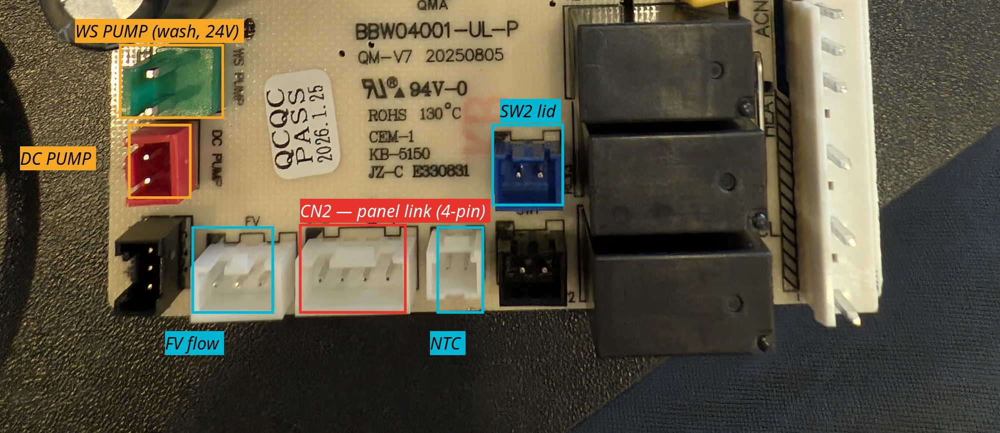
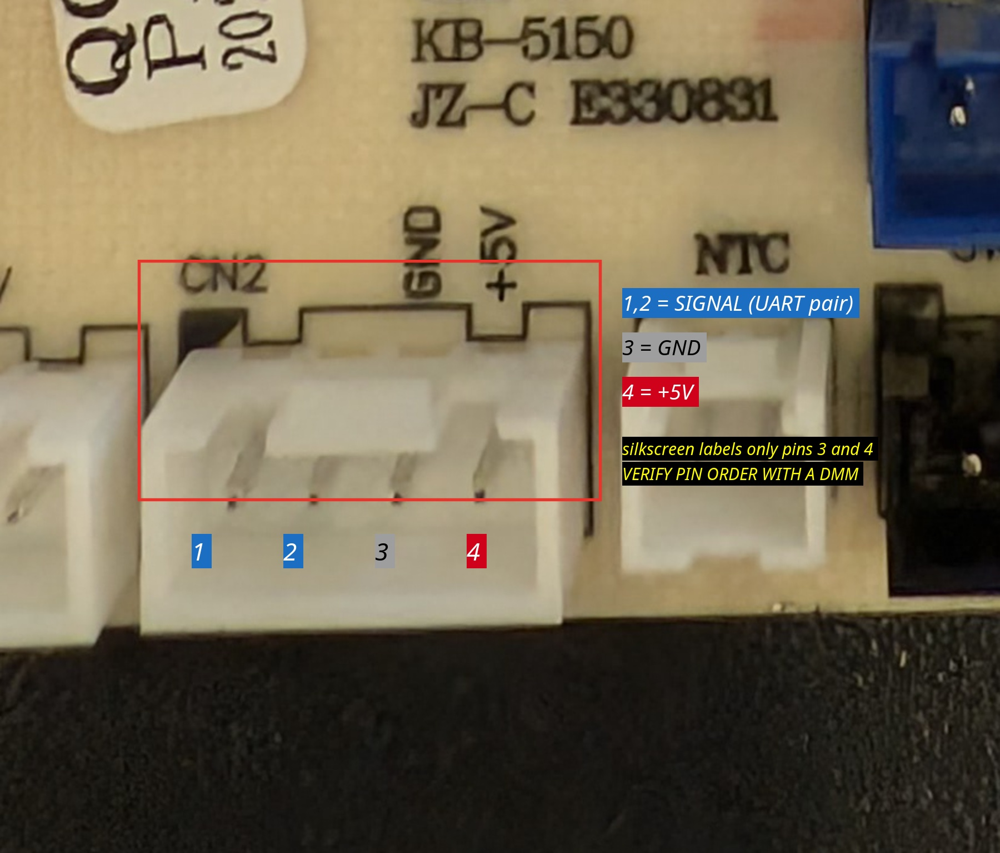
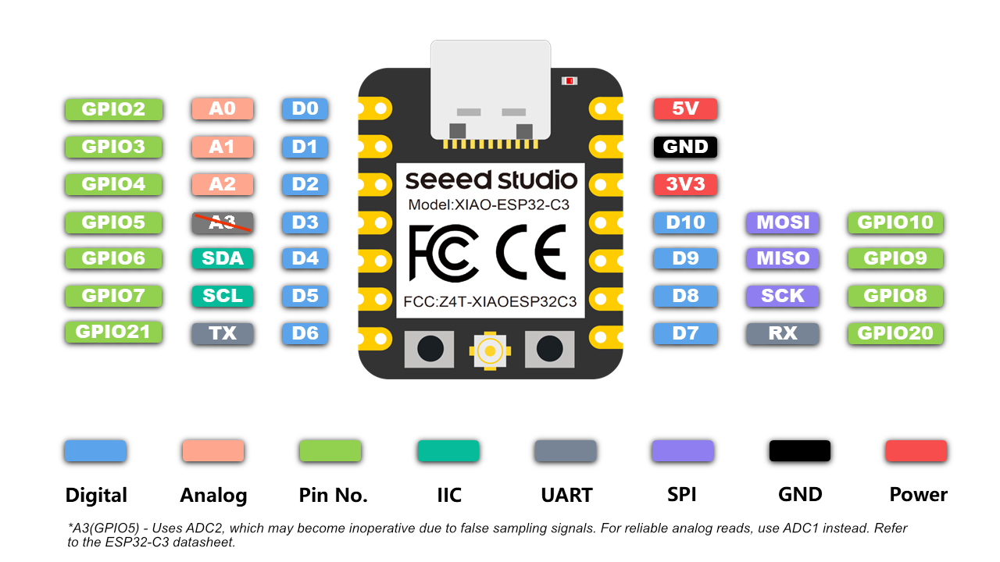
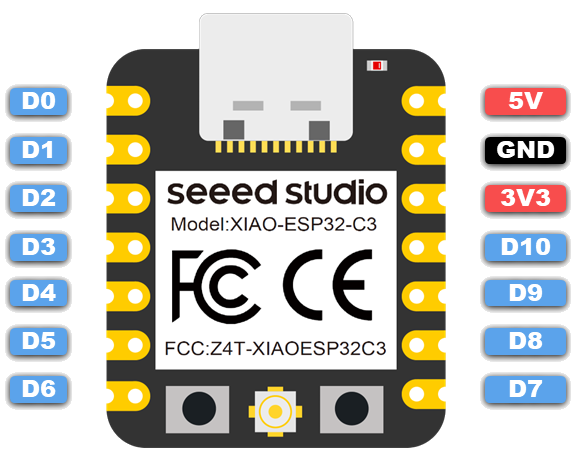

# Build it

⚠️ Read [safety.md](safety.md) first. Unplug the machine before opening it.

⚠️ **This procedure was written on a Momcozy D8 (`BW05`).** The connector
location, pin order, logic level and load bits are that board's. On any other
machine, measure each of them yourself — steps 1–3 are exactly the measurements
that tell you whether it matches.

## Parts

| | |
|---|---|
| **Seeed XIAO ESP32-C3** | the brain. Any ESP32 with two hardware UARTs works; the pin advice below is C3-specific |
| **4-channel BSS138 level shifter** | the panel link is 5 V. Measure yours first — see below |
| 4-pin JST-XH pigtails ×2 | to splice into the panel connector, if you would rather not solder to the board |
| a few cm of wire, pin header | for the tap |
| *optional* relay module | only if a load needs driving directly — see [the wash-pump note](#if-a-load-will-not-switch) |

There is an optional carrier PCB in [`hardware/pcb/`](../hardware/pcb/) — a
31.5 × 26 mm board that holds the XIAO, the shifter and three connectors, with
Gerbers ready to order. Perfectly fine on stripboard instead.

## 1. Find the panel link

Look for a **4-pin connector** between the front panel and the controller board.
On the Momcozy D8 it is silkscreened `CN2` — the full board tour, including which
connector drives which load, is in [board.md](board.md).

<p align="center">
  
</p>

<p align="center">
  
</p>

Two pins carry signals, two carry power:

| Pin | Function |
|---|---|
| 1 | signal — controller → panel |
| 2 | signal — panel → controller |
| 3 | `GND` |
| 4 | `+5V` |

⚠️ **Confirm the order with a meter before trusting the silkscreen.** On this board
the rotated labels sit slightly right of the pins they name. Power the board, find
which pin sits at 5 V relative to chassis and which is continuous with ground.
Thirty seconds, and it is the one mistake that damages things.

## 2. Measure the logic level

**Do this before ordering anything.** CN2 supplies 5 V, and that does **not** mean
it signals at 5 V. Put a meter or a scope on a signal line at standby.

| Measured HIGH | What you need |
|---|---|
| ~5 V | **level shifter** (or a 10 kΩ / 20 kΩ divider on each ESP32 receive line) |
| ~3.3 V | **connect direct**, no shifter |

⚠️ Getting this backwards is the most expensive mistake available here: a 10k/20k
divider on an already-3.3 V line yields **~2.2 V**, below the C3's input threshold.
The symptom is a stream of framing errors that looks exactly like a wrong baud
rate, and you will spend the evening trying other baud rates.

The D8 measures **5.13 V**, so it needs the shifter.

## 3. Tap it — LISTEN first

**Do not cut anything yet.** Solder four short wires to the connector's pads on
the solder side and bring them to a header, or back-probe the housing. Leave the
panel plugged in.

Flash the firmware ([flash.md](flash.md)) and leave it in **LISTEN** mode, where
the UARTs are opened with no TX pin — the firmware physically cannot drive a line.
Then run:

```
POST /api/detect
```

It counts edges to find which two pins are driven, reads one frame off each, and
tells you which is the controller (`0xA2` header) and which is the panel (`0xAA`).
It never transmits.

**This is the step that makes the next one safe.** Connecting an ESP32 transmit
pin to something that is also an output is the way to damage a board.

## 4. Go inline

Two ways to get the ESP32 into the link. **Prefer the first — it cuts nothing.**

### A. Inline adapter (reversible)

`CN2` is a plug-in connector, so the module can sit **in** the cable:

```
controller  ──► [ J1  module  J2 ] ──►  panel
```

You need a 4-pin JST-XH **male** header toward the controller and a **socket**
for the panel's existing cable. The carrier board in
[`hardware/pcb/`](../hardware/pcb/) is exactly this — `J1` to the controller,
`J2` to the panel, with pins 3 and 4 passing straight through on the copper.

Unplug it later and the machine is stock. Nothing is cut, nothing is soldered to
the OEM board.

### B. Cut and splice

If you cannot source the connectors, cut **CN2 pins 1 and 2 only** and bring all
four stubs to the ESP32. Still reversible with a solder joint, but not as neatly.

⚠️ **Either way, leave pins 3 and 4 connected panel↔controller.** The panel is
powered through them; break all four and it goes dead.

<p align="center">
  
</p>

| ch | Stub | | Shifter | XIAO | UART |
|---|---|---|---|---|---|
| 1 | CONTROLLER pin 1 — output | → | `HV1` · `LV1` | `D1 / GPIO3` | `Serial0` **RX** |
| 2 | CONTROLLER pin 2 — input | ← | `HV2` · `LV2` | `D2 / GPIO4` | `Serial0` **TX** |
| 3 | PANEL pin 1 — input | ← | `HV3` · `LV3` | `D3 / GPIO5` | `Serial1` **TX** |
| 4 | PANEL pin 2 — output | → | `HV4` · `LV4` | `D4 / GPIO6` | `Serial1` **RX** |

**Power:** controller pin 4 (+5 V) = panel pin 4 = shifter `HV` = XIAO `5V`, one
net. XIAO `3V3` → shifter `LV`. Controller pin 3, panel pin 3, both shifter `GND`
pads and XIAO `GND` all common.

**The rule that decides every connection:** an **output** stub lands on an ESP32
**RX** pin; an **input** stub is **driven** by an ESP32 **TX** pin.

> If an ESP32 RX pin is wired to an *input* stub it sees no traffic at all and
> counts **zero bytes forever** — check `/api/status`. Nothing is ever transmitted
> on an input.

Two properties make the wiring hard to get wrong: **channel N carries pin DN**,
and **the HV side groups by device** — ch1/ch2 controller, ch3/ch4 panel.

⚠️ Wire to the shifter's **printed pad names**. Rotated so HV faces the machine,
its pads read `HV4 · HV3 · GND · HV · HV2 · HV1` down the board — not 1 to 4. The
photo inset in the diagram shows it.

## Pin choice, if you deviate

`D1`–`D4` are plain GPIOs. The others are not:

| Pin | Why not |
|---|---|
| **GPIO21 (D6)** | UART0 TX — the ROM bootloader transmits boot messages on it at every reset, injecting garbage into the panel link |
| GPIO9 (D9) | BOOT button **and** strapping — held low at reset means download mode |
| GPIO8 (D8) | strapping pin |
| GPIO2 (D0) | strapping pin |
| GPIO20 (D7) | UART0 RX — safe, it is an input |

<p align="center">
  
</p>

<p align="center">
  
</p>

<sub>XIAO ESP32-C3 pinout and block diagram © Seeed Studio.</sub>

The C3 routes UARTs through the GPIO matrix, so any free pin works and a UART's
two pins need not be adjacent. It has exactly **two** hardware UARTs — precisely
enough.

**Why BSS138 is fine on a UART:** open-drain, low side driven actively, high side
pulled up through ~10 kΩ, so rise time is RC-limited to ~0.5 µs — irrelevant
against a 104 µs bit at 9600 baud, and UART idles HIGH which is the right resting
state. Don't reuse this above a few hundred kbaud.

## Power

Take it from **CN2 pin 4**, shared with the shifter's `HV` reference.

⚠️ That rail was sized for a button panel drawing tens of milliamps, and an ESP32
peaks near 300 mA on WiFi transmit. It has proven adequate here, but if your panel
browns out, power the ESP32 separately and share only ground. Using pin 4 purely
as a level-shifter reference draws microamps and is always safe.

## If a load will not switch

On this machine the controller's own low-side switch for the **wash pump** does
not close when the panel commands it. The firmware can drive that load through an
**external relay module** on a spare GPIO instead, following the same bit the
machine would have used — so cycles behave normally.

Default pin is **GPIO10 (D10)**, active-high, runtime-settable via
`POST /api/wsrelay`.

⚠️ **Fit a pull-down resistor**: 10 kΩ from the relay pin to GND for an
active-high module (to 3V3 for active-low). The GPIO is high-impedance from reset
until the firmware starts, and in safe mode it is never configured at all — only a
passive resistor holds the load off in those windows. Prefer an opto-isolated
module with a separate `JD-VCC`.

## Confirm it

Do not assume it works because the machine looks normal — see
[troubleshooting.md](troubleshooting.md) for the four-path test, the link-quality
counters and the margin test.
