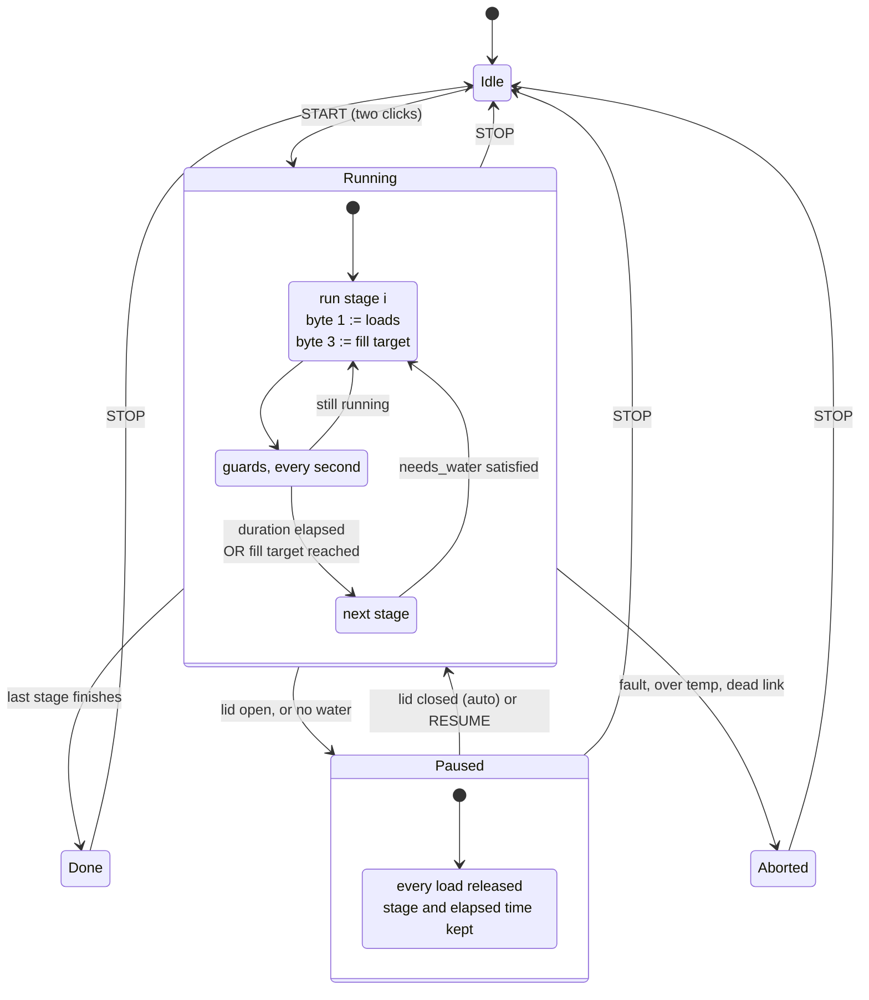

# Cycles

The ESP32 drives the loads itself, with the panel held idle. Six built-in
programs, six slots of your own, per-stage durations you can edit and save.

⚠️ **Starting a cycle drives 120 V heaters and a water pump with nothing above
it.** The START button takes two clicks for that reason. Read
[safety.md](safety.md) before the first run, and do not leave it unattended.

⚠️ The built-in programs are the **Momcozy D8's**, from its manual and from
captures of that machine. On any other washer treat them as a starting point to
edit, not as correct.

## The ESP32 cycle runner

Same shape, but every stage boundary and every load is decided here, and the panel
is held idle throughout. Six programs, one per mode in the manual — see
[Programs](#programs).

**Validated on hardware.** A full Normal Wash ran end to end from the ESP32:
eleven stages, no aborts, every fill hitting its commanded count exactly
(90 / 80 / 20, and the untargeted flush ending on time).



### Pause, not abort

Two conditions **pause** instead of aborting, and the split follows the manual
rather than taste:

| | Behaviour | Manual |
|---|---|---|
| **lid open** | pause, **auto-resume** when it closes | *"the system will automatically recognize this and resume operation once the lid is closed"* |
| **no water** | pause, wait for **Resume** | *"add water, then press the Start/Pause button"* |

A lid opened to add one more bottle should not throw away a 29-minute cycle.
Pausing releases **every load**; the stage and its elapsed time are kept, so a
resume continues where it stopped rather than restarting the stage.

**Verified on hardware** under PROBE (guards live, `loads=0x00` on the wire):
four open/close cycles, pause within ~1 s of the lid opening, auto-resume within
~1 s of it closing, same stage each time, no aborts. The runner ticks at 1 Hz.

PROBE is the right way to rehearse this — it forces the panel→controller bytes to
zero, so the runner behaves as it would live while the machine can do nothing.

The asymmetry is deliberate: closing the lid is observable from the link, a
refilled tank is not — there is no tank sensor. So the lid clears itself and water
waits for a human.

Everything else still **aborts**: a controller fault bit, over temperature, or a
dead link are not conditions standing at the machine fixes.

### The guards

The machine protects **none** of this. Confirmed, not assumed: the controller
gates nothing except the intake motor, the heaters fire with no water and the lid
open, and neither end has a fill timeout. So every interlock lives in the runner.

| Guard | Trips when | Why it has to exist here |
|---|---|---|
| **verified fill** | a `needs_water` stage would start without a completed fill | nothing else checks there is water before a heater runs |
| **fill complete** | the count has not moved for 3 s | at ~2.2 counts/s that is seven missed pulses — the controller has stopped feeding, so the target is met |
| **fill stall** | the count has not moved for 15 s *and never advanced at all* | neither end has a fill timeout — a fill whose count never arrives runs **forever** |
| **fill overrun** | the count exceeds the target by 10 | backstop in case the controller's reset is ever missed |
| **over temperature** | byte 1 ≥ 96 | byte 1 is uncalibrated and reads *low*, so this is conservative on purpose |
| **lid open** | either lid bit sets | the machine will happily run with the lid off |
| **fault bit** | any of status bits 2–6 | the controller has noticed something we have not |
| **dead link** | no controller frame for 3 s | we would otherwise be driving loads blind |

**Abort always means the same thing:** clear every override, release every load,
stop. There is no partial state to reason about.

### Programs

Six, from the manual's table (p.25–26), selected by the tabs above the stage
list. Each carries its own stage list, its own saved durations, and the manual's
maximum water temperature as an **extra abort ceiling on top of the global one**
— so Rapid Wash aborts at 55 °C even though steam is allowed to reach 96.

| Program | Manual | Runner | Max °C | Stages |
|---|---|---|---|---|
| Rapid Wash | 19 min | 17 min timed + fills | **55** | 7 |
| Normal Wash | 29 min | 27 min timed + fills | **68** | 10 |
| Steam Sterilization | 9 min | 8 min timed + fill | 96 | 4 |
| Drying | 60 min | 60 min | 96 | 2 |
| 72h Fresh Air Storage | 72 h | 72 h | 96 | 2 |
| Self-Cleaning | 30 min | 25 min timed + fills | **70** | 8 |

Totals exclude fills, which run until their target lands (~40 s each), bringing
each program within a minute or two of the manual.

**Normal Wash** and **Self-Cleaning** are from end-to-end captures — their stage
lists are what the machine actually did. The others follow the same drain / fill /
heat / flush / dry skeleton with the manual's durations and are **not** verified.

Durations are editable per program and persist; editing one does not touch another.
`POST /api/cycle?mode=<n>` switches, and is ignored mid-cycle.

### Temperature targets

Two per program, editable and persisted:

| Program | water target | dry ceiling | abort max |
|---|---|---|---|
| Rapid Wash | 50 °C | — | 55 |
| Normal Wash | 60 °C | — | 68 |
| Steam Sterilization | 92 °C | — | 96 |
| Drying | — | 80 °C | 96 |
| 72h Storage | — | 60 °C | 96 |
| Self-Cleaning | 65 °C | 80 °C | 70 |

⚠️ **There is one temperature sensor on this machine** — byte 1, the sump NTC.
There is no air probe, which is also why the manual lists no maximum temperature
for Drying. So the two settings are not symmetric:

- **water target** is a real setpoint. A heat stage (`b2`) ends when byte 1
  reaches it, whichever comes first between that and the stage duration. This is
  what the OEM does — it released the heater at exactly 57 °C in two independent
  cycles.
- **dry ceiling** can only be a *ceiling* on that same reading. A dry stage
  (`b3`/`b4`) **aborts** above it. It is a guard, not a target, because nothing
  measures the air.

Both are clamped to the program's maximum. Asking Rapid Wash for 90 °C gives 55 —
a setpoint the abort guard would trip on first is not a setpoint, it is a trap.

`0` disables either one, leaving the stage to run its full duration under the
global 96 °C ceiling.

### Stage table — Normal Wash

| # | Stage | Loads | Fill target | Default |
|---|---|---|---|---|
| 1 | drain | `b1` | — | 20 s |
| 2 | fill 90 | `b5` | `0x20` → 90 counts | until filled |
| 3 | wash + heat | `b0+b2` | — | 600 s |
| 4 | drain | `b1` | — | 20 s |
| 5 | fill 80 | `b5` | `0x1C` → 80 counts | until filled |
| 6 | rinse + heat | `b0+b2` | — | 480 s |
| 7 | drain | `b1` | — | 20 s |
| 8 | fill 80 | `b5` | `0x1C` → 80 counts | until filled |
| 9 | rinse + heat | `b0+b2` | — | 480 s |
| 10 | drain | `b1` | — | 20 s |

Steam is its own program here, matching the manual, which lists Wash and Steam
Sterilization as separately selectable functions that combine.

## User programs

**Six slots**, appended after the six built-ins. Create, edit, rename and delete
them — a free slot is not a program and does not appear as a tab on either page.

### Canonical form — what the device stores

Each stage is exactly **7 characters**: a 4-letter code, then two digits and a
unit.

```
CODE nnU
DRAN 20S     drain 20 seconds
FILL 90P     fill to 90 %, no time — it ends when the count stops
WASH 05M     wash + heat, 5 minutes
FLSH 70S     flush 70 seconds
DRYR 10M     dry 10 minutes

   DRAN20S,FILL90P,WASH05M,FLSH70S,DRYR10M
```

One table covers both the canonical form and the readable one used in JSON files:

| Canonical | Readable | Bits | Load |
|---|---|---|---|
| `DRAN` | `drain` | `02` | drain |
| `FILL` | `fill N` | `20` | fill to a target |
| `PUMP` | `wash` / `pump` | `01` | 24 V wash pump, no heat |
| `WASH` | `wash+heat` | `05` | wash pump + water heater |
| `STEM` | `steam` / `heat` / `waterheat` | `04` | 110 V water heater, no circulation |
| `AIRH` | `airheat` | `08` | air heater |
| `BLOW` | `blower` | `10` | blower |
| `DRYR` | `dry` | `18` | air heater **and** blower — the machine's dry phase |
| `FLSH` | `flush Ns` | `22` | drain + fill together, untargeted |
| `WAIT` | `wait` | `00` | nothing commanded; needs a duration |

Readable words combine with `+`, as in `wash+heat`. `intake` alone is `20`.

**Units:** `S` seconds, `M` minutes, `H` hours — so `99H` is the ceiling and the
72-hour storage program is expressible as `DRYR72H`.

**`P` is a fill percentage** against a 100 % fill, and it maps 1:1 to flow
counts. The four the machine itself uses:

```
FILL20P -> byte3 0x07      FILL90P -> byte3 0x20
FILL80P -> byte3 0x1C      FILL99P -> byte3 0x23
```

**Commas separate stages.** They are always present on output and optional on
input, so `DRAN20S,FILL90P` and `DRAN20SFILL90P` are the same thing — the fixed
width means the separator is for reading, not for parsing.

`[A-Za-z0-9,]` only — no spaces, nothing that needs URL-encoding, and a stage
count that is always the length divided by 7 once the commas are removed.

Round-trips exactly through the device. Errors name the actual problem:

```
DRAN20S,FILL90  -> canonical form is 7 chars per stage (CODEnnU) — length is not a multiple of 7
XXXX20S        -> unknown code — DRAN FILL PUMP WASH STEM AIRH BLOW DRYR FLSH WAIT
DRAN20X        -> unit must be S, M, H or P
WASH20P        -> P is a fill percentage — only FILL takes it
```

`python3 tools/cycle_tool.py pack "drain 20s" "fill 90" "wash+heat 5m"` converts.

### Readable form — for authoring

```
drain 20s        fill 90          wash+heat 5m
steam 7m         flush 70s        dry 10m         wait 30s
```

Durations take `s`, `m` or `h`; a bare number is seconds. Two forms carry a fill
target instead: **`fill N`** runs the intake motor until N flow counts have
arrived and needs no duration (it ends when the count stops), and **`flush Ns`**
is drain+fill with no target and *needs* one, since nothing else would end it.

⚠️ **Use integer arithmetic** for both `fill N` and `FILLnnP`:
`byte3 = (N × 7 + 10) / 20`, which reproduces all four targets. `0.35f` is `0.349999994`, so `90 × 0.35f` = `31.4999995` and
`fill 90` silently became `0x1F` — **two counts short**. 0.35 is exactly 7/20.

The byte is what the machine acts on; the count is derived, and a stage ends when
the counter stops moving rather than at a computed number.

All input forms — canonical, hex triples, `loads:target:seconds`, readable — store
identical bytes, and the device always returns the canonical form.

### Editing as a file

```bash
python3 tools/cycle_tool.py dump > cycles.json   # device -> file
python3 tools/cycle_tool.py check cycles.json    # validate locally, no device
python3 tools/cycle_tool.py load cycles.json     # file -> device
python3 tools/cycle_tool.py load cycles.json --replace   # also clear unlisted slots
```

[`tools/cycles.json`](../tools/cycles.json) ships with four worked examples and
the syntax in its own comment block.

```json
{
  "version": 1,
  "programs": [
    {
      "slot": 2,
      "name": "Rinse only",
      "comment": "No heat at all — a cold rinse for something already clean.",
      "stages": ["drain 20s", "fill 80", "wash 3m", "drain 20s"]
    }
  ]
}
```

`check` runs the device's own rules locally, so a mistake is caught before
anything is written:

```
✗ slot 5 'Bad': 'wash+heat 5m': water heater before any fill — dry fire
1 program(s) would be rejected
nothing written
```

The device validates independently and is authoritative; on disagreement `load`
prints `REJECTED BY DEVICE` and says why.

Two are seeded on a **fresh device** so the feature is discoverable — exactly once,
so a deleted seed stays deleted:

| | Spec |
|---|---|
| **Quick check-up** | `02:00:20, 20:07:0, 05:00:120, 02:00:20, 10:00:60` |
| **Triple Wash** | `02:00:20, 20:20:0, 05:00:300, 02:00:20, 20:1C:0, 05:00:300, 02:00:20, 20:1C:0, 05:00:300, 22:FF:70, 18:00:420` |

Edit in the CUSTOM PROGRAM box on `/dev`, or `POST /api/custom`. **+ new** opens
the first free slot; **delete** takes two clicks. Deleting the selected program
falls back to Normal Wash. Verified end to end, reboot included.

### The rules, and why each exists

Every list is validated before it is accepted, because a hand-written stage list
is exactly where this machine's missing interlocks would bite. Each rule encodes
something the captures established:

| Rejected | Because |
|---|---|
| water heater with no fill since the last drain | **dry fire.** The controller will do it without complaint; nothing else checks |
| intake with no fill target | does nothing at all — the only gate the controller has |
| target `0xFF` with the drain shut | `0xFF` is the untargeted flush, and **neither end has a fill timeout**. With the drain shut it is an unbounded fill with nothing to stop it |
| an untargeted flush with no duration | nothing would ever end it |
| no loads and no duration | a hang, not a stage |
| panel byte 1 bits 6 or 7 | never seen set in 99,285 frames; their loads are unknown |

Each case is tested, including that a drain wipes the fill state so a heater
after it is still rejected, and that valid programs are accepted.

⚠️ The validator stops the mistakes that are **visible in the stage list**. It
cannot tell whether there is water in the tank, whether the lid is on, or whether
a 40-minute heat stage is sensible. The runtime guards cover the first two; the
third is yours.

### Deliberate differences from the OEM cycle

**No 37-minute dwell.** It is a real part of the OEM wash cycle and it is
omitted, because a runner that appears to hang for half an hour is a runner
people will interrupt. Add it as a stage with `loads = 0` if you want fidelity.

**Steam is a separate program**, as the manual has it, rather than a stage inside
the wash. The OEM combined cycle runs two steam phases separated by the dwell.

**Heater stages are guarded on a verified fill.** The OEM is not — it relies on
its own sequencing being correct. The runner refuses instead.

⚠️ **Starting this drives 110 V heaters and a water pump with nothing above it.**
The START button takes two clicks for that reason. Read [safety.md](safety.md)
before the first run, and do not leave it unattended.
