# Using it

Three ways in, all over plain HTTP on your own network. No cloud, no account.

| | |
|---|---|
| `http://baby-washer.local/` | **The app.** Pick a program, start it, watch progress. Nothing on it can force a load. This is the one to use day to day. |
| `http://baby-washer.local/dev` | **Engineering page.** Everything below. It drives 120 V heaters and a water pump directly. |
| **Home Assistant** | entities, commands and a dashboard — see [`homeassistant/`](../homeassistant/) |

Programs, custom cycles and the stage syntax are in [cycles.md](cycles.md);
every control here is also an HTTP endpoint, in [api.md](api.md).

mDNS is used so nothing has to track the DHCP lease. If your network drops
`.local` names, the IP works too — `/api/version` reports it.

---

## The engineering page

> ⚠️ **Everything on `/dev` acts on a live machine.** Panel byte 1 is a load
> bitmap and the controller gates almost none of it: heaters fire with no cycle
> running, no water, and the lid open. Read [safety.md](safety.md) before you
> click anything on this page.


A masonry packer: cards flow into however many columns fit, `MACHINE` pinned
first, nothing fixed-width — so a phone gets one column of the same cards rather
than a scaled-down desktop layout.

---

## MACHINE

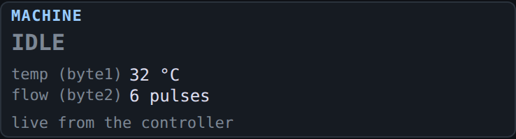

**Temperature** (byte 1, uncalibrated, °C) and the **flow pulse count** (byte 2)
for the fill in progress. The count is **not** a lifetime total — the controller
zeroes it ~1.5 s after intake is released.

## WASH PUMP RELAY

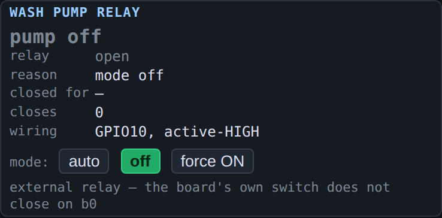

Drives the external relay that runs the wash pump, because **the control board's
own low-side switch does not close when panel b0 is commanded** — verified by
sending a frame byte-identical to the one the machine sends during its own wash
phase. See [hardware.md](build.md) for the pin choice and the mandatory pull
resistor.

| Mode | Behaviour |
|---|---|
| `auto` | Follow b0 of the panel frame **as forwarded**. Default. |
| `off` | Contacts held open whatever b0 does. |
| `force ON` | Closed. Not persisted — a reboot returns to `auto`. |

`auto` reads the *forwarded* byte, so the machine's own cycles, the cycle runner
and any b0 override all drive the pump.

**`reason` is the field to read** — `panel b0`, `mode off`, `waiting for a synced
link`, `panel link idle`, `runtime cap reached`. `closes` counts contact wear.

The pump reports nothing back, so a 30-minute runtime cap and a 3-second link
watchdog are the only protection there is.

## CONTROLLER → PANEL

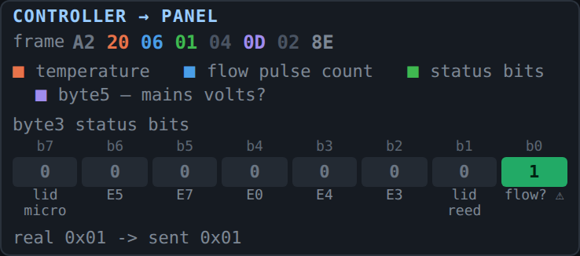

The raw 8-byte controller frame, colour-keyed, with byte 3 broken out bit by bit
— hover any bit. `real → sent` shows the byte as received and as forwarded, so an
active override is visible rather than implied.

⚠️ **b0 is unresolved.** It was documented as a no-flow flag; that was retracted
after a flow counter frozen for 5.7 s under commanded intake failed to set it.
Do not use it as a dry-run alarm. [protocol.md](protocol.md) has both surviving
readings and the experiment that separates them.

## PANEL FRAME (panel → controller)

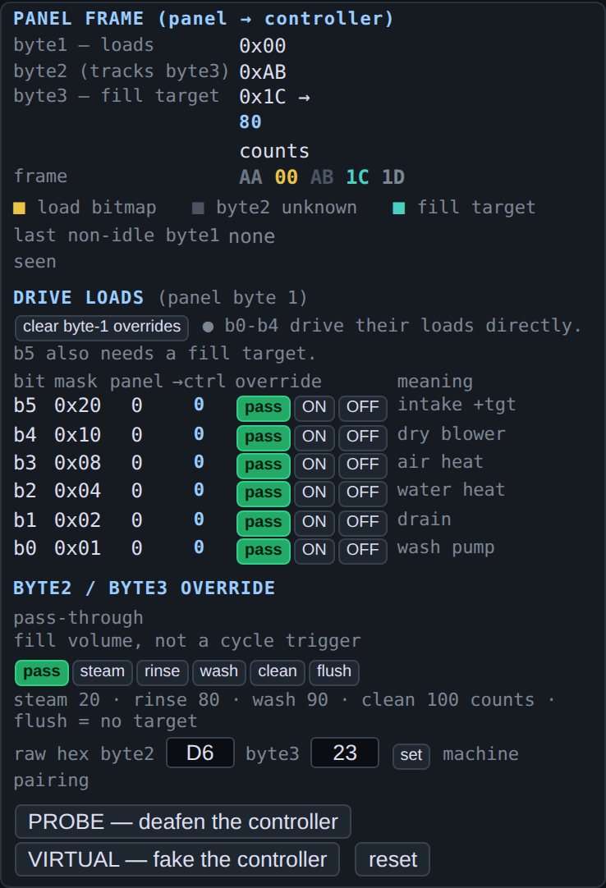

The command side, and the most dangerous card on the page.

**DRIVE LOADS** forces individual bits of byte 1. Each bit is `pass` / `ON` /
`OFF`, and `ON` energises that load on a real machine immediately — no cycle, no
interlock, no water check. `b5` (intake) is the one exception: it needs a
non-zero fill target in byte 3, which is the only gate we can demonstrate.

⚠️ `b0` is the odd one out — commanding it does not close the board's own switch
for the wash pump, which is why that pump is on an external relay.

**BYTE2 / BYTE3 OVERRIDE** sets the fill target — the four values the machine
uses, plus the `0xFF` sentinel for the cool-down flush, which is only ever sent
with the drain open because nothing at either end will time it out.

**PROBE** feeds the controller a permanently idle frame, so buttons can be pressed
with no possibility of starting a cycle. **VIRTUAL** fakes the controller
entirely, so the panel can be exercised with the machine inert. Start here, not
with the load bits.

## CYCLE RUNNER

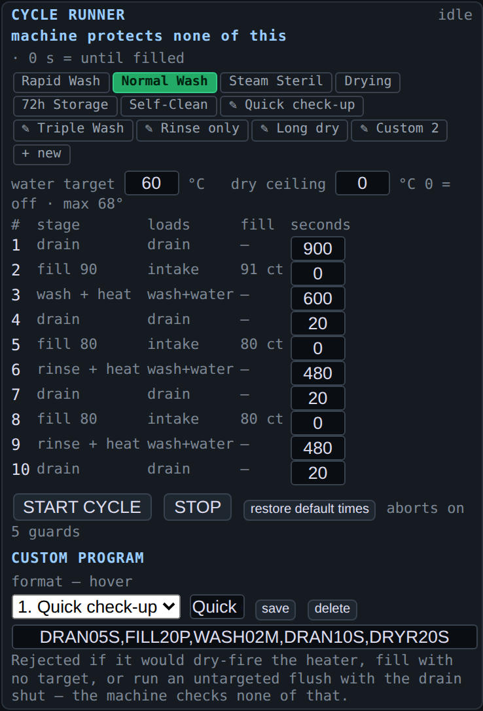

Six built-in programs, six user slots, per-stage durations you can edit and save.

**The runner carries its own interlocks because the machine has none.** Lid open
and no-water *pause* rather than abort — a lid pause self-resumes, a water pause
waits for **Resume** — plus a maximum temperature, a fill stall timeout and a
fill ceiling.

Custom programs use a fixed-width stage syntax, seven characters each:

```
DRAN20S,FILL90P,WASH05M
CODEnnU   4-letter code, 2 digits, unit S/M/H — or P for a fill percentage
```

The device validates every program and says why it refused one. See
[cycle.md](cycles.md) for the full grammar and `tools/cycle_tool.py` for loading
them from JSON.

## ERROR CODES

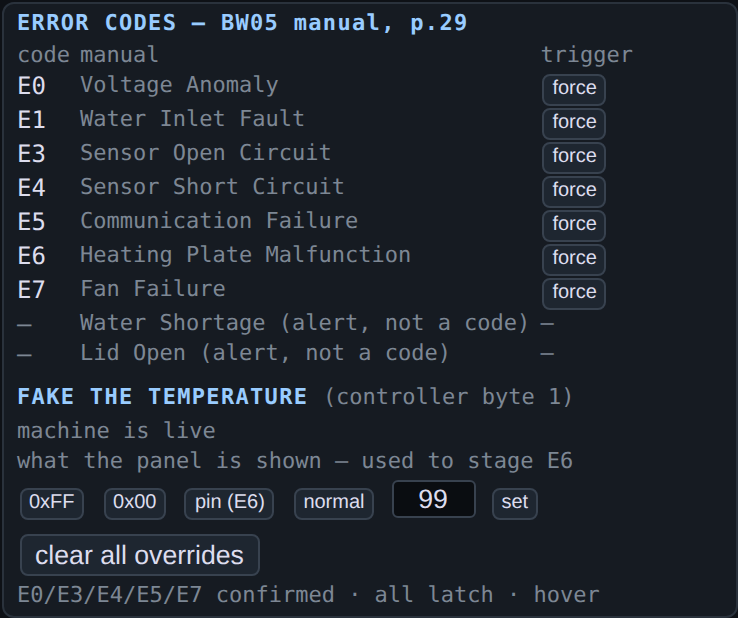

Each code has a **force** button that injects the corresponding bit toward the
panel. Two things to know: **fault codes latch at the panel**, so clearing the
condition is not enough — the machine needs a power cycle; and `E7` (possibly
others) only appears while a cycle runs, which is why it was nearly written off as
a dead bit.

**FAKE THE TEMPERATURE** rewrites byte 1 toward the panel — pinning a value is how
`E6` was staged. `clear all overrides` drops the status mask, temperature override
and flow spoof in one click.

## LID

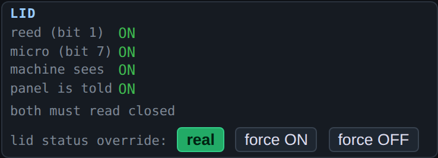

Two sensors — reed/magnet on bit 1, micro switch on bit 7 — and the machine only
calls the lid shut when both read closed. The override moves both together;
moving one would show the panel half an open lid. It changes only what the panel
**displays** — the controller reads the real switches regardless.

## TEMPERATURE and FLOW

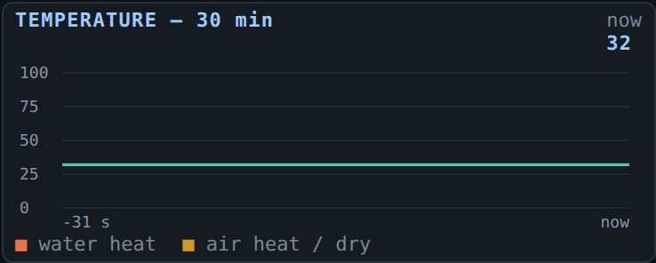

Thirty minutes at 1 Hz, with two heater lanes underneath — **water heat** and
**air heat / dry**. Separate colours because they are separate loads, and telling
them apart is most of reading a cycle.

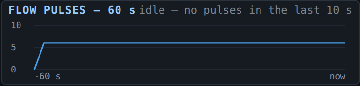

Sixty seconds of flow. A fill shows as a steady climb; the plateau at the end of
the cool-down flush is the sump emptying.

---

## Diagnostics

Collapsed by default — click **diagnostics** in the section nav. While hidden,
these endpoints are not polled at all.

### PIN AUTODETECT

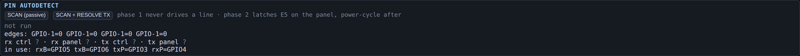

Finds the CN2 pin map and writes it to NVS, so a wiring change costs a click, not
a reflash. **Phase 1 never drives a line.** Phase 2 resolves the TX pins by
transmitting, which latches `E5` on the panel — power-cycle afterwards.

### LINK QUALITY

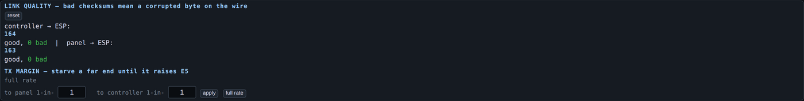

Checksum counters per direction. This is the number that matters when
re-terminating a CN2 stub.

⚠️ **A valid checksum is not proof of alignment.** The panel's idle frame is
self-similar: start one byte late and `AA 00 00 00 AA` reads as a valid frame
forever. That was observed live for 386 consecutive frames with zero errors
counted. `worst gap` and the frame history are how you catch it.

`thin` forwards only 1 frame in N — the TX-margin test.

### CHANGE DETECTOR

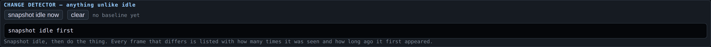

Snapshot the idle frames, then show anything that differs. Most of the byte map
was found this way: known state, snapshot, change one thing, read off what moved.

### LINK and the four frame views


**FLOW sim** drives pulses at the given rate at the controller's flow input —
open-drain, so the real sensor can stay connected and the two wire-OR. `freeze`
stops the raw log scrolling.

The four cards below show each direction **before and after rewrite** —
`RX FROM CONTROLLER` / `TX TO PANEL`, and `RX FROM PANEL` / `TX TO CONTROLLER`.
Comparing a pair is the fastest way to confirm an override is really on the wire
rather than only in the UI.

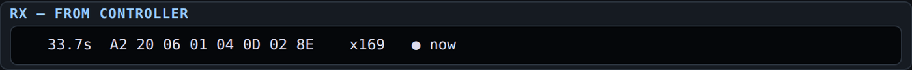
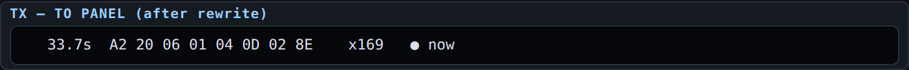
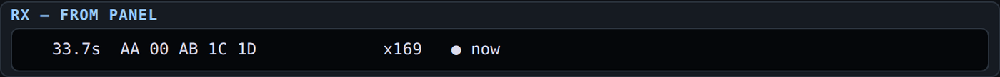
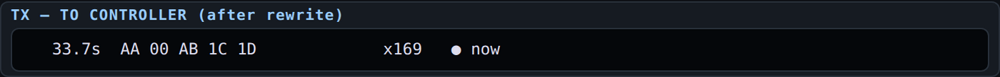

### RAW ROLLING LOG

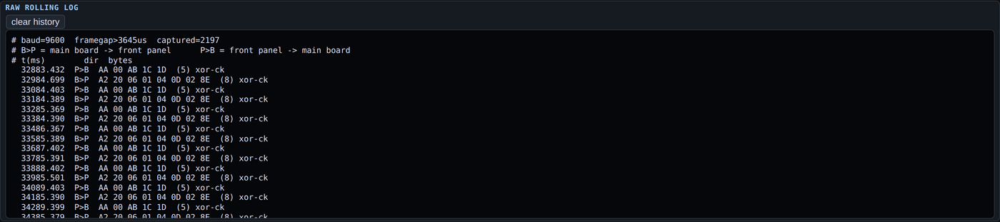

Every captured byte with timestamps and checksum candidates. Freeze it to read a
moment without it scrolling away.

---

## On a phone

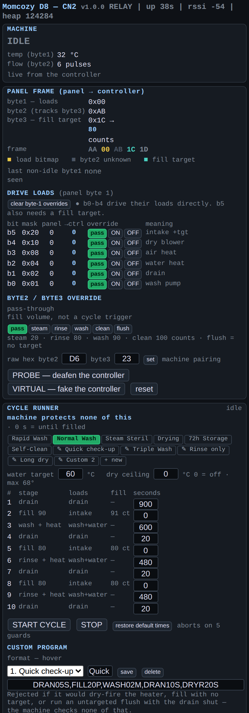

Same cards, one column, no horizontal scroll. Wide content — the frame views and
the raw log — scrolls inside its own box rather than pushing the page sideways.

---

## Automating it

Every control here is an HTTP endpoint, documented in [api.md](api.md). The UI is
a client, not a privileged one.

```bash
curl -X POST 'http://baby-washer.local/api/wsrelay?mode=auto'
curl -s     'http://baby-washer.local/api/status' | jq .wsr_why
```
